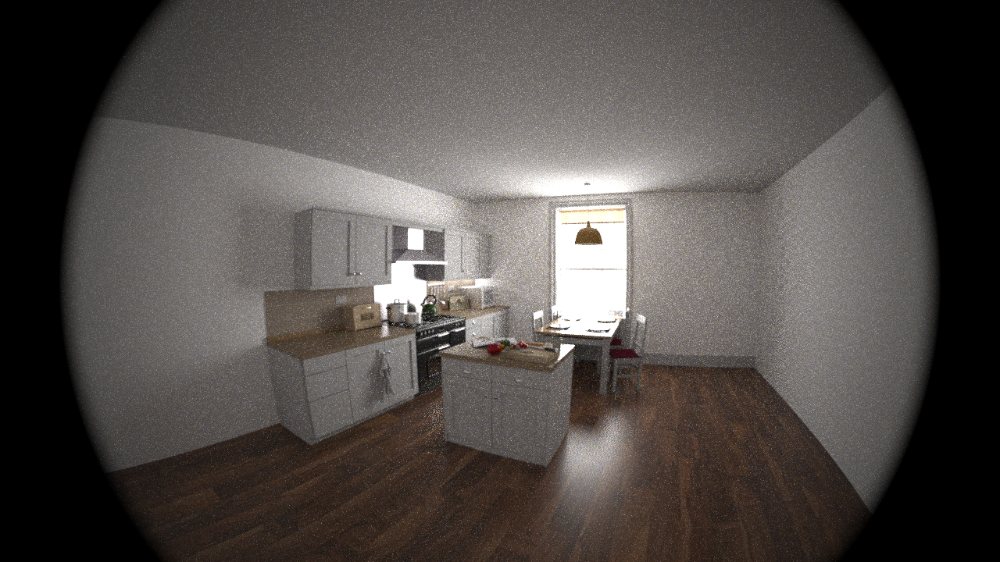
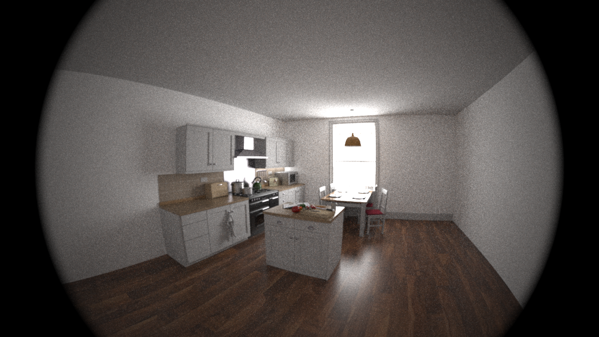
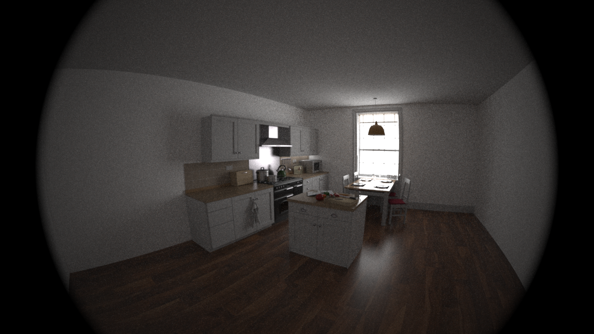
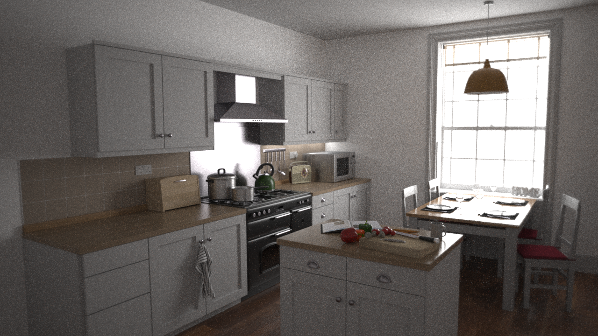
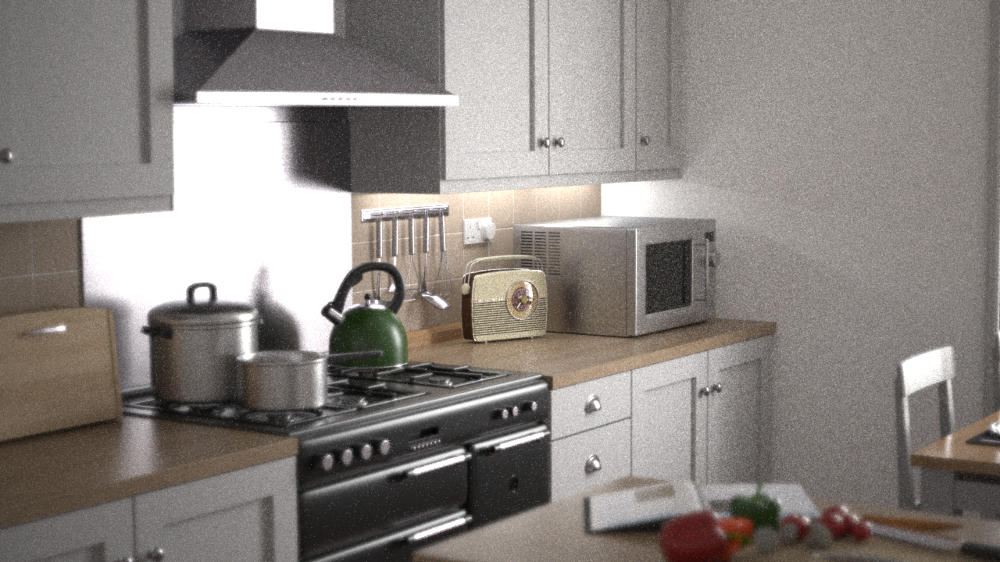
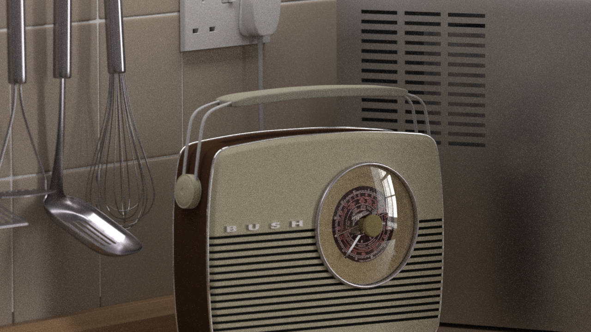
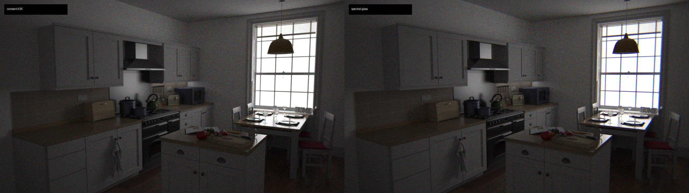
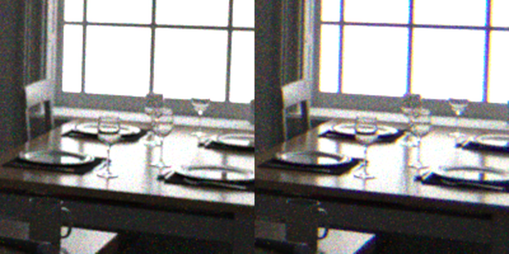
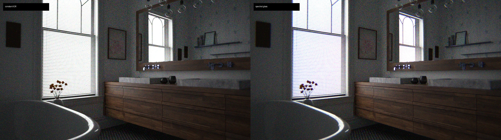
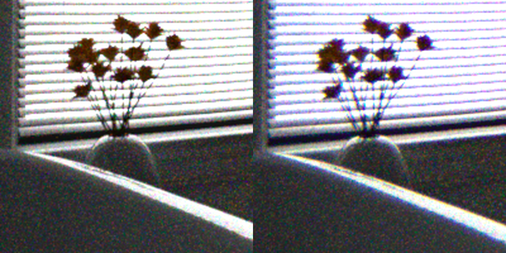

# Mitsuba Realistic Camera

PBRT-style realistic lens camera for Mitsuba 3, implemented as a Python sensor
plugin. Importing the package registers `sensor type="realisticcamera"` for the
currently selected Mitsuba variant.

The implementation loads PBRT lens `.dat` files, traces rays through the lens
stack, supports aperture stops/masks, exit-pupil sampling, thick-lens focusing,
and wavelength-dependent glass data for spectral rendering. Lens surfaces are
represented by a small extensible interface, so additional surface models such
as Zemax `EVENASPH` can be added without rewriting the camera trace loop.

## Installation
The project was built and tested with Python 3.10 on Windows 10, with dependencies on:

- `mitsuba=3.8.0`
- `drjit=1.3.1`

We test the project with the `cuda_ad_rgb` and `cuda_ad_spectral` Mitsuba variants, but it should be compatible with any variant that supports Python sensors and ray tracing.
To install, clone the repository and run:
```bash
pip install -e .
```


## Minimal Usage

Set a Mitsuba variant first, then import the package once:

```python
import mitsuba as mi

mi.set_variant("cuda_ad_rgb")
import mitsuba_realistic_camera  # registers sensor type="realisticcamera"

scene = mi.load_file("your/scene.xml")
image = mi.render(scene, spp=64)
mi.Bitmap(image).write("output.exr")
```

XML sensor example:

```xml
<sensor type="realisticcamera">
    <string name="lens_file" value="lenses/wide.22mm.dat"/>
    <string name="lens_directory" value="scenes/kitchen"/>
    <float name="aperture_diameter" value="8.0"/>
    <float name="focus_distance" value="3.0"/>
    <float name="film_diagonal" value="35.0"/>
    <float name="mm_to_world" value="0.001"/>
    <boolean name="use_exit_pupil" value="true"/>
    <boolean name="debug_lens_trace" value="false"/>
    <sampler type="independent">
        <integer name="sample_count" value="64"/>
    </sampler>
    <film type="hdrfilm">
        <integer name="width" value="1024"/>
        <integer name="height" value="768"/>
    </film>
</sensor>
```

Note that the we support lens data stored as .dat files, with additional support of glass name lookup for spectral rendering. See the scene in `examples/scenes/kitchen` for an example usage. 

## Examples

### PBRT Validation

The fisheye kitchen render agrees visually with the PBRT reference. 

| PBRT reference | Ours |
| --- | --- |
|  |  |


### Field Of View Across Lenses

The same kitchen scene rendered with different physical lens descriptions. The change in field of view comes from changing the lens stack, not from a pinhole camera FOV parameter.

| Fisheye 10mm | Wide 22mm |
| --- | --- |
|  |  |

| Double-Gauss 50mm | Telephoto 250mm |
| --- | --- |
|  |  |

### Defocus Blur

The kitchen scene uses the `dgauss.50mm.dat` lens while sweeping
`focus_distance` from 3.0m to 8.0m. The blur is produced by tracing through the finite aperture and lens set.


### Spectral Lens Support

The plug-in supports wavelength-dependent lens data for spectral rendering. The `wide_spec.22mm.dat` lens file provides an example. The spectral render shows a subtle chromatic aberration effect that is not present in the constant-IOR double-Gauss lens. 

Kitchen full frame:



Kitchen zoomed-in:



Bathroom full frame:



Bathroom zoomed-in:



For spectral variants, the example script marks monochrome bitmap maps such as
opacity/bump masks as `raw=true`, which avoids Mitsuba treating the same bitmap
as both a spectrum and a scalar texture.

## Limitations and Planned Features
- The project currently does not support flare and diffraction effects.
- The lens is limited to spherical and axis-aligned surfaces. Support for aspherical and freeform surfaces is planned for a future updates.
- The lens data format is currently limited to PBRT .dat files, with support for Zemax lens files planned for the future.

